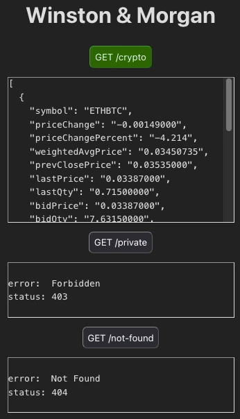

# LOGGING WITH WINSTON AND MORGAN #

Demo of how to log HTTP requests and debugging data in an Express server, using Winston and Morgan.

---

This demo is based on [this article](https://betterstack.com/community/guides/logging/how-to-install-setup-and-use-winston-and-morgan-to-log-node-js-applications/) by [Ayooluwa Isaiah](https://github.com/ayoisaiah).

It uses the following Node Module dependencies:
* cors
* dotenv
* express
* morgan
* winston

---

Clone the repo and then run `npm i` and then `npm start`.

In the Console, you should see something like:

> ```console
>         LOGGING STARTED
> Express server listening at:
>   http://localhost:1337
>   http://127.0.0.1:1337
>   http://192.168.0.11:1337
> ```

Press the Ctrl key (or ⌘ on Macintosh) and click on one or more of these links to open a page in your browser. Click on the different buttons in the web page and check the output in the Console and in the `http.log` file.



You might see something like this:

> ```text
> 	     LOGGING STARTED
> 
> Treated:  2024-11-16 00:17:38.079
> from:     ::ffff:127.0.0.1
> method:   GET
> url:      /private
> status:   403
> length:   14
> ms delay: 2.632
> 
> Treated:  2024-11-16 00:17:38.823
> from:     ::ffff:127.0.0.1
> method:   GET
> url:      /crypto
> status:   200
> length:   650
> ms delay: 1928.093
> 
> Treated:  2024-11-16 00:17:39.046
> from:     ::ffff:127.0.0.1
> method:   GET
> url:      /not-found
> status:   404
> length:   148
> ms delay: 1.785
> ```

Note that the request for `/crypto` takes much longer to process, so if you click on the three buttons in quick succession, the results for `/crypto` may be logged _after_ the results for the other buttons.

Visiting the different origins (such as `localhost`) should give you different values for the `from` field.